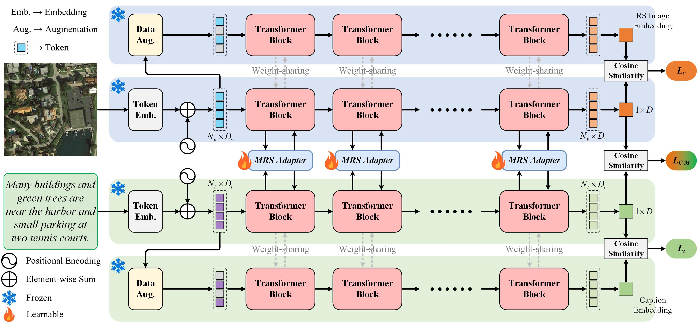

# Parameter-Efficient Transfer Learning for Remote Sensing Image-Text Retrieval
##### Author: Yuan Yuan, Yang Zhan, Zhitong Xiong
This is the official repository for paper **"Parameter-Efficient Transfer Learning for Remote Sensing Image-Text Retrieval"**. [[Paper](https://ieeexplore.ieee.org/document/10231134)]

**School of Artificial Intelligence, OPtics, and ElectroNics (iOPEN), Northwestern Polytechnical University**

## Please share a <font color='orange'>STAR ⭐</font> if this project does help

## 💬 Introduction
This is the novel and sophisticated PETL framework for the RS image-text retrieval task, the PyTorch source code of the paper "Parameter-Efficient Transfer Learning for Remote Sensing Image-Text Retrieval". Specifically, the proposed framework consists of the pretrained CLIP model, the multimodal remote sensing adapter (MRS-Adapter), and a hybrid multi-modal contrastive (HMMC) learning objective.

1. We design a simple yet effective loss function: the hybrid multi-modal contrastive (HMMC) loss for PETL-based RS image-text retrieval. Experimental results prove that the proposed HMMC loss is effective in further improving the performance on top of the proposed MRS-Adapter.
2. We provide comprehensive empirical studies for the PETL-based RS image-text retrieval task. Our qualitative and quantitative results demonstrate that the proposed method is promising and of great potential for practical applications.
3. Extensive experiments show that our approach can significantly reduce 98.9\% of fine-tuning parameters without performance sacrifice compared to full fine-tuning. Our retrieval performance exceeds traditional methods by 7-13\%. The comprehensive benchmark results are insightful for future research.


### 🚀Network Architecture
<p align="middle">
    
</p>


## 📦Download Data
The RSITR dataset can be downloaded from our [Google Drive](https://drive.google.com/drive/folders/1F6WBQB-1PLqABh-uDv9m-KPdChakWcWY?usp=sharing). The download link is available below:
```
https://drive.google.com/drive/folders/1F6WBQB-1PLqABh-uDv9m-KPdChakWcWY?usp=sharing
```

We expect the directory and file structure to be the following:
```
./                      # current (project) directory
├── README.md
└── data/                        # Dataset
    ├── rsicd_precomp/           # RSICD
        ├── rsicd_images/        # Remote sensing images
        ├── train_caps.txt       # Captions of training and validation set
        ├── train_filename.txt   # Image name of training and validation set
        ├── test_caps.txt        # Captions of test set
        └── test_filename.txt    # Image name of test set
    ├── rsitmd_precomp/          # RSITMD
        ├── rsitmd_images/       # Remote sensing images
        ├── train_caps.txt       # Captions of training and validation set
        ├── train_filename.txt   # Image name of training and validation set
        ├── test_caps.txt        # Captions of test set
        └── test_filename.txt    # Image name of test set
    ├── ucm_precomp/             # UCM
        ├── ucm_images/          # Remote sensing images
        ├── train_caps.txt       # Captions of training and validation set
        ├── train_filename.txt   # Image name of training and validation set
        ├── test_caps.txt        # Captions of test set
        └── test_filename.txt    # Image name of test set
```


## 👁️Remote Sensing Image-Text Retrieval Visualization
<p align="middle">
    
</p>

## 🔍Results
<p align="middle">
    
</p>

<p align="middle">
    
</p>

<p align="middle">
    
</p>


## 📜Reference
If you found this code useful, please cite the paper. Welcome :+1:_<big>`Fork and Star`</big>_:+1:, then I will let you know when we update.
```
@ARTICLE{10231134,
  author={Yuan, Yuan and Zhan, Yang and Xiong, Zhitong},
  journal={IEEE Transactions on Geoscience and Remote Sensing}, 
  title={Parameter-Efficient Transfer Learning for Remote Sensing Image–Text Retrieval}, 
  year={2023},
  volume={61},
  number={},
  pages={1-14},
  doi={10.1109/TGRS.2023.3308969}}
```


## 🙏Acknowledgments
We benchmark extensive state-of-the-art PETL methods on the PE-RSITR task. Our code is based on [GaLR](https://github.com/xiaoyuan1996/GaLR). We sincerely appreciate their contributions and authors for releasing source codes. I would like to thank Xiong zhitong and Yuan yuan for helping the manuscript. I also thank the School of Artificial Intelligence, OPtics, and ElectroNics (iOPEN), Northwestern Polytechnical University for supporting this work.
